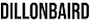

<div align="center" id="top"> 
  
</div>

# > npx dillon

[](https://www.npmjs.com/package/dillon)
[](https://www.npmjs.com/package/dillon)

Just a small/simple cli portfolio I created as a little fun. Give it a try yourself by running "npx dillon" from your terminal (with node installed).

## Usage

NOTE: Requires Node v16 or later

```
$ npx dillon
```